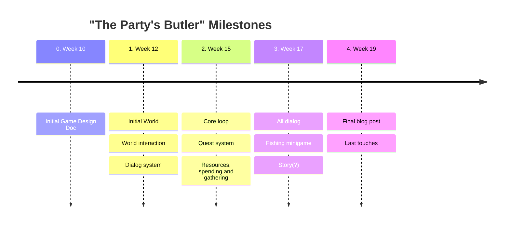

# Entry 1: Initial Game Design Document

## Timeline

## The quick an dirty considerations

* Working title
	* The Party's Butler
* Concept
	* A Farm life sim-like/management game, that has the player has the player enjoy the peaceful life of keeping the castle of a small adventuring party.
* Genre(s)
	* Life sim
	* Management
* Unique Selling points
	* The game aims to increase the relaxation, found in other life sim games like Stardew Valley, by rethinking how different mechanics interact with this goal. While doing this the game will will allow players to experience a different quiet life in a fantastical world.
* Player experience and POV
	* The player will take on the role of a butler to an adventuring party that recently were gifted a run down castle. The player will then work to restore the castle back to something great, while also representing the party in the goal of improving life in the adjacent village.
* Art style
	* A warm and colorful low-res pixel art
	* Instrumental medieval-like music
* Setting
	* The game is set in a high fantasy world, inspired by the Forgotten Realms. The game will primarily take place in the the castle and the adjacent village. During the game the player will be able to experience the downtime taken by the castles adventuring party, and hear small anecdotes from their adventures
* Monetization
	* A onetime purchase
* Platform
	* Made for PC and the VIA Arcade machine. The game is a 2D game made in Unity. The game will be made by a single person during the GMD1 elective at VIA university
* Game play loops
	* During the main loop of the game the player will manage and gather resources for the player and the castle. The player will use the resources to improve castle, both aesthetically and the aspect of how it's run. The player can also use the resources to improve the community of the village.
* Objectives and Progression
	* A overall objective of improving the castle and the life of the player, the adventuring party, and the village
	* Uses a quest system to teach mechanics and provide different shorter term goals 
* Game systems
	* "Friendship meters"
	* Time cycle, as a resource based on actions
	* Quest system
	* Building and crafting

## Characters

### The party

* Lillea Godard
	* Halfling
	* Female
* Ash Oarsman
	* Says he's a human (Actually Half-Celestial)
	* Male
* Aïra Teye
	* Half-Elf
	* Female
* Maraziath ~~Cragmourn~~ Thulavea
	* Giant kin
	* Male
	* looses the Cragmoun name in a fight

### Friends of the party

* Tarkash
	* Dragon kin
	* Female
* Xander Salamander
	* Lizard folk
	* Male
	* A kind of steward
* Curator Finnja Hannawald
	* Male
	* Friend of Lillea
	* Curator of museum on Elven history in Marsember (new name)

### Villagers

* little betty
	* half orc
	* Female
	* smith
* Otto
	* Human
	* Male
	* generals store
* Asher Brooks
	* Human
	* Bearded
	* Sheepherder
* May
	* Halfling
	* Female
	* Inn owner
* Samuel
	* Halfling
	* Male
	* Son of May
* Macie
	* Human
	* Female
	* Mason
* Collin
	* Half Elf
	* Male
	* Carpenter
* Zacharia
	* Gnome
	* Male
	* Young Handyman
	* Tinkere
* Hawkwood
	* Human
	* Male
	* Mercenary
	* leader of the Bloodhawks
	* staying in the inn
