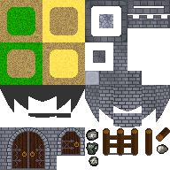

# Entry 2: Milestone 1
## Initial World

For the initial world, the plan was to create, at least, part of the castle that the player with work at and on. The castle was planed to be a 3 storey building, with a ground floor, a second floor, and a basement. For this milestone the focus, of the world, has only been on the ground floor, the sprites used, the object structure making the world work, and how the **world** interacts with the player.

### Sprites

In order to have a greater amount of control over the look of the game, it has been decided to try and create the majority of the sprites manually for the project.

The Game will use a 16x16 pixel sprite units. In order to group sprites on what purposes they have, one main big sprite asset was created, and could then be set up to be read as several sprites in unity. Sprites for the project was created in Gimp. Gimp was used in order to give access to some more advanced image editing tools, like e.g. noise, maps, and layers. To start out, 3 ground textures sets where created, sand, dirt, and grass sets. Afterword sprites for a castle was created.



Then once the sprite sheet is imported into unity, the sprite sheet can be split into several sprites. Once this is done, then the sprites can be used to create tile palettes.

### Layers

In order to give the game the look of having some amount of physical depth in the world there are different strategies. One way of doing this is to have several layers of tile sets. You can create a background layer, a middle ground layer, and a foreground layer. Then the background layer will show behind the player, and the layer has no need for a collision component, as the player should always pass in front of everything on the background layer. Similarly you have the foreground layer show over the player, and again have no collider. Lastly the middle layer will then have a collider and the layout of the world that the player navigates.

Afterword several layers can be made for any other needed use-cases, like maybe a dedicated layer for player placed tiles, but this was not done during this milestone.

## World interaction

World interaction is a very vague goal on this mile stone, but in essence what was actually meant was to implement the basics of world interaction. Specifically the interaction types where, movement, and a way of "clicking"/confirming that the player wants to interact with a world object.

This project makes use of the new Unity Input system, and uses implicit input event bindings.

### Player and Camera movement

For player movement a composite input action is used to just get a Vector2, which is then used to add force to a rigid body magnified by a speed set in the editor.

```cs
    void Update()
    {
        if (movement.magnitude == 0)
        {
            rb.velocity = Vector3.zero;
        }
        rb.AddForce(movement * speed);
    }

    void OnMove(InputValue inputValue)
    {
        movement = inputValue.Get<Vector2>();
    }
```

There isn't any interest in having having the player continuously glide around until it hits a collider, as such the the velocity is set to 0 once the input vector reaches a magnitude of 0.

Instead of having the camera move with the player, a system is implemented to let the player kind of "push" the camera. A small virtual window around the player is created and then when the player moves outside one of the edges of the window, the camera is pushed in that direction. Each edge of the window is pushed separably in order to have it pushed like a square instead of a circle.

### Virtual "cursor"

One of the targeted platforms for the game will have to game run with only one digital joy stick and 6 buttons, and as such there is a need to create a sort of selector that doesn't require a mouse or similar.

The selector, is a game object that mostly sits the first tile in front of the player. This is done by looking looking at what direction the the is moving and then bounding looking vector axes into a {-1;1} range. The selector is then also always rounded into it's current coordinate.

In order to then have the selector be able to activate another gameObject, the selector has a collider. The collider is disabled by default, and then the collider gets enabled on a button down, and disabled again on button up. Then the other gameObjects can react on the selector being enabled while on top of their collider.

## Dialogue system

One of the important systems in the game is the ability to talk with NPCs. Talking with NPCs can both be its own gameplay in the way that the player can be give incentive to be social with neighbors to either learn what stories they have to tell, or potentially get gives from becoming friends with a NPC.

Dialogue systems can also be used for things like tutorial messages, tell the player about the world, tool tips, and so on.

The dialogue system was originally created following a [tutorial](https://blog.yarsalabs.com/creating-a-dialogue-system-in-unity/) but large parts of the code was later changed to better fit the use-cases of this game, and even more is likely to change in the future.

### Data

For storing the dialogue 2 classes has been created. One class is just a simple container contain a single dialogue line, currently this is just 1 string field. This class is then the main field of `ScriptableObject` that contains an array of dialogue lines. By using a `ScriptableObject` to store dialogue, then dialogue can be stored as an asset in the project. It might be a bit superfluous to not just use a text document if dialogue is just a list of lines, but if dialogue later fits into a slightly more complicated object structure, which is the hope, then it'll save time then.

### Display

Dialogue is displayed in a UI object, and as suck is displayed on a canvas instead of "in the world." The dialogue display objects consists of a empty parent, a image object, and a text. For the image a sprite was created such that it could be used for any size UI object. The sprite is then set to tile when the image object gets larger.


Once the display is activated, then the players standard input is disabled. The player can then only fire events to get the next dialogue line, and can't move around the map.

### Activation

One scenario of dialogue interaction is when talking to NPCs, when doing this the player will press a button to activate the selector, the collider of the selector will then trigger a `OnTriggerEnter2D` event on the NPC object. The event then set what line should be displayed and activates the dialogue display.