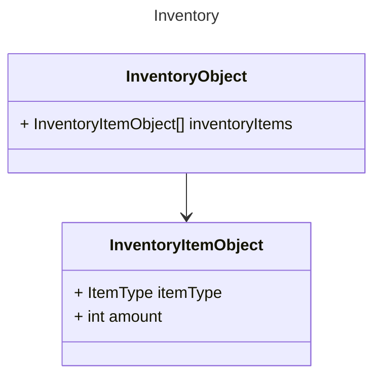

# Entry 3: Milestone 2
## Resources
The plan for this milestone, in reflection of resources, was to design what resources are, where to get resources, how to get resources, and where resources are stored. `Resources` was originally referring to several different opes of resources, like items, time, energy, and/or potentially other similar things. During work the scope was narrowed to being specifically about item resources and the aspects surrounding that.
### Items
When considering items, a start can be defining item types, for this a `ScriptableObject` class is created to contain the parameters of the item types. For now the only parameter that is really needed is the type name, but the class can in future be set up to contain stuff like, item sprites, crafting recipes, gold value, and/or similar.
In order to have the item drop when breaking a world object, some `MonoBehavior` classes handles the behavior of how to "harvest" items from world objects, this includes handling world object health, spawning drops, and picking drops up.
### Inventory
For handling storing of items, a `ScriptableObject` class holding a list of a wrapper that contains an itemtype and a count of how many of that type the inventory has. 

This way there is no reason to store more then one instance of type of item, and instead just count how many items there are. Currently the ItemType is just a description, but it could be extended to have a stack limit, so that each slot in a inventory object can't hold endless amount of 1 item.
## Quest system
A quest system can allow for giving the player suggestions for some objective that the player can choose to do whenever they want or strait ignore, this is the goal for this quest system. Here the idea is to help people who might get lost as to what can be done or what should be done.
For this game quest flow is design such that, the player interacts with a dialogue line and then ending the dialogue line fires an event that might then activate a quest. Current the player can just view their quests, but can actually complete them.
