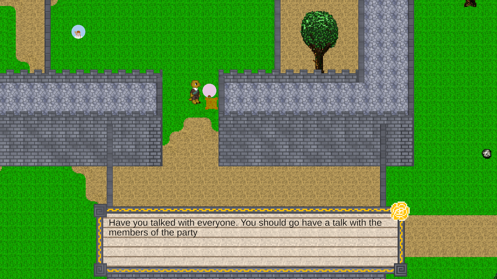
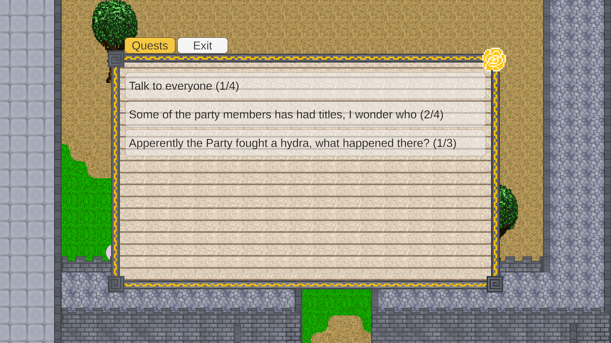
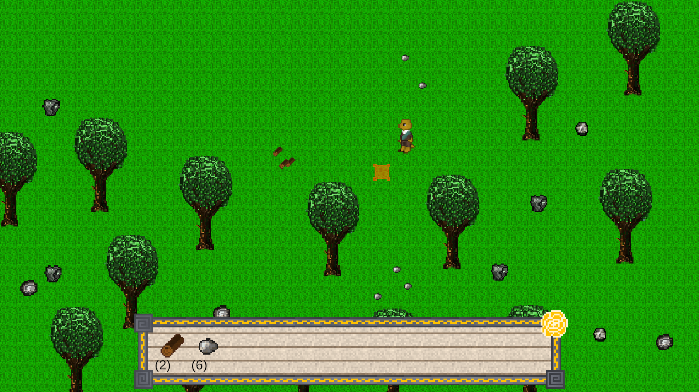

# Entry 5: The Partys Butler

The Partys Butler, is now in a playable state, but is probably closer to a demo then a full game. You can now go around the castle and talk to the members of the titular party. When talking with the party members you can read some of their stories, and they will sometimes send you on quest to either talk with other party members or collect resources. The game has several different systems that interact in different ways.

## Dialogue

There is a dialogue system were you go walk around and talk with the party members. During dialogue you can discover 101 unique dialogue lines, and get presented with a large handful of dialogue options.

After interacting with the dialogue system, by either finishing a dialogue or picking a dialogue option, an event system will broadcast information about what type of interaction was done, and sometimes what specific instance it was with.

## Quests

One of the things that listens to dialogue events is the quest scheduler og tracker. The scheduler waits on a dialogue to trigger an event that says that a quest has been started, then he scheduler puts one of the 6 quests on the quest log.

Once on the quest log, the tracker will listen for other dialogue events that will make the quest progress, these events come in different forms depending on the quest but all are fired by a dialogue.

## Resources

Some quests might require the player to gather some resources in order to be completed, in this case a player will hit a tree or rock several times until an amount of items are dropped.

The game currently contains definitions of 2 item types, wood and stone, both of which are required for a quest.

## Future

For any potential future updates for the game, there are several things that could be good additions. It was originally the plan to create several areas and have a wider cast of NPCs, this could a lot more content, and allow for several more stories to be told.

I wanted to create a crafting system, that would allow the player to use the resources to create different things that they could place around the castle ground, or to maybe craft tools to make resource gathering easier.

Providing a wider array of different play features would also help to combat burnout, by allowing a player to always have some aspect of the game that they might not be burned out with. When doing this it is important to insure that every feature serves to work towards one collected progression loop.