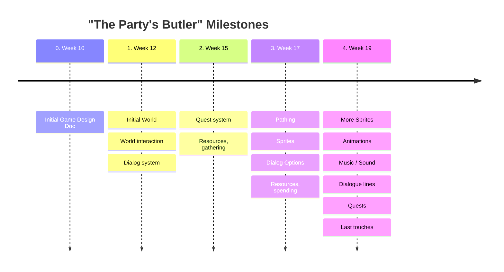

# The Party's Butler

Blog post links

[Entry 0: Roll a Ball](./BlockPosts/Entry0.md)

[Entry 1: Init. Game Design Document](./BlockPosts/Entry1.md)

[Entry 2: Milestone 1](./BlockPosts/Entry2.md)

[Entry 3: Milestone 2](./BlockPosts/Entry3.md)

[Entry 4: Milestone 3](./BlockPosts/Entry4.md)

[Reflections](./ReflectionsOnGameDevelopment.md)

## Link to YouTube Demo

A demo to the game I've created can be found on YouTube.

[
Watch YouTube Demo](https://youtu.be/Nx88Q1UvS0o)

## Third Party assets

* Music: [https://assetstore.unity.com/packages/audio/music/orchestral/adventure-rpg-essentials-music-pack-177827](https://assetstore.unity.com/packages/audio/music/orchestral/adventure-rpg-essentials-music-pack-177827)

# Living Game Design Document

## Timeline

## The quick an dirty considerations

* Working title
	* The Party's Butler
* Concept
	* A Farm life sim-like/management game, that has the player has the player enjoy the peaceful life of keeping the castle of a small adventuring party.
* Genre(s)
	* Life sim
	* Management
* Unique Selling points
	* The game aims to increase the relaxation, found in other life sim games like Stardew Valley, by rethinking how different mechanics interact with this goal. While doing this the game will will allow players to experience a different quiet life in a fantastical world.
* Player experience and POV
	* The player will take on the role of a butler to an adventuring party that recently were gifted a run down castle. The player will then work to restore the castle back to something great, while also representing the party in the goal of improving life in the adjacent village.
* Art style
	* A warm and colorful low-res pixel art
	* Instrumental medieval-like music
* Setting
	* The game is set in a high fantasy world, inspired by the Forgotten Realms. The game will primarily take place in the the castle and the adjacent village. During the game the player will be able to experience the downtime taken by the castles adventuring party, and hear small anecdotes from their adventures
* Monetization
	* A onetime purchase
* Platform
	* Made for PC and the VIA Arcade machine. The game is a 2D game made in Unity. The game will be made by a single person during the GMD1 elective at VIA university
* Game play loops
	* During the main loop of the game the player will manage and gather resources for the player and the castle. The player will use the resources to improve castle, both aesthetically and the aspect of how it's run. The player can also use the resources to improve the community of the village.
* Objectives and Progression
	* A overall objective of improving the castle and the life of the player, the adventuring party, and the village
	* Uses a quest system to teach mechanics and provide different shorter term goals 
* Game systems
	* ~~"Friendship meters"~~
	* ~~Time cycle, as a resource based on actions~~
	* Dialogue system
	* Quest system
	* Resource gathering and trading
	* ~~Building and crafting~~

## Quests

Quests

1. Great everyone (start from Lillea)
2. Gather wood to repair bridge (Start from Crag)
3. Learn about the locked doors (Start from a door)
4. Listen to story about the hydra fight (Start from Aîra)
5. Gather stone for some graves (Start from Ash)
6. Learn about Titles (Start from Aïra)

## Characters

### The party

* Lillea Godard
	* Halfling
	* Female
	* Full Description:
		> Lillea is a about 90 cm tall halfling female, of an adult age. She wears a set of a set of dark travelers clothes (while it probably has a hood, she would not use it), that looks to be well used but also well kept, over this she wears a set of dark leather armor. If you have thought about it/asked her, then these clothes appear to be of this color not for the look, but for the practical use. She has lapis colored eyes and lightly tanned skin, she wears her long chestnut colored hair in a loose ponytail. She carries 2 shortswords, and what looks to be some sort of magic bag. From her hip hangs a sling and a pouch of something (really just bullets for the sling not really a secret). She looks very friendly. Lillea carries herself in a very happy way, she almost spring in her step. She is very nice and talkative.

* Ash Oarsman
	* Says he's a human (Actually Half-Celestial)
	* Male
    * Full Description:
        > Ash is a spry pale young human by all accounts. He is of average build, not in the most fit of shape, but certainly not as portly as others from noble birth. This may be because of his recent growth spurt, as he is quite young, or it may be some other reason he could have been excluded from the typical upbringing befit of his ilk. His dark charcoal hair has a shock of pale silver through it which is accentuated by his relatively short cropped hair. His eyes glow a stark emerald which seem to carry sadness or shame behind them when no one is looking. He carries his mace and shield with him, though he clearly and often favours the holy symbol of the pendant of a skeletal arm holding balanced scales. Short tempered, and often quick to frustration, he is slowly learning to temper this with kindness and friendship he is finding in his new found family.
        (in an ideal world Ash would have had his mace fashioned like a  censer and was going to commission it the next time we were back in a city with a black smith, so he could spread smoke and pleasant smells during battle)
* Aïra Teye
	* Half-Elf
	* Female
* Maraziath ~~Cragmourn~~ Thulavea
	* Giant kin
	* Male
	* looses the Cragmoun name in a fight
	* Full Description:
		> Maraziath Thulavea is a giant kin Paladin. He is 50 years old, 6"11 tall, and appears to weigh about 218 lbs. He has white eyes, bald hair, and bronze skin.

### Friends of the party

* Tarkash
	* Dragon kin
	* Female
* Xander Salamander
	* Lizard folk
	* Male
	* A kind of steward
* Curator Finnja Hannawald
	* Male
	* Friend of Lillea
	* Curator of museum on Elven history in Marsember (new name)

### Villagers

* little betty
	* half orc
	* Female
	* smith
* Otto
	* Human
	* Male
	* generals store
* Asher Brooks
	* Human
	* Bearded
	* Sheepherder
* May
	* Halfling
	* Female
	* Inn owner
* Samuel
	* Halfling
	* Male
	* Son of May
* Macie
	* Human
	* Female
	* Mason
* Collin
	* Half Elf
	* Male
	* Carpenter
* Zacharia
	* Gnome
	* Male
	* Young Handyman
	* Tinkere
* Hawkwood
	* Human
	* Male
	* Mercenary
	* leader of the Bloodhawks
	* staying in the inn
