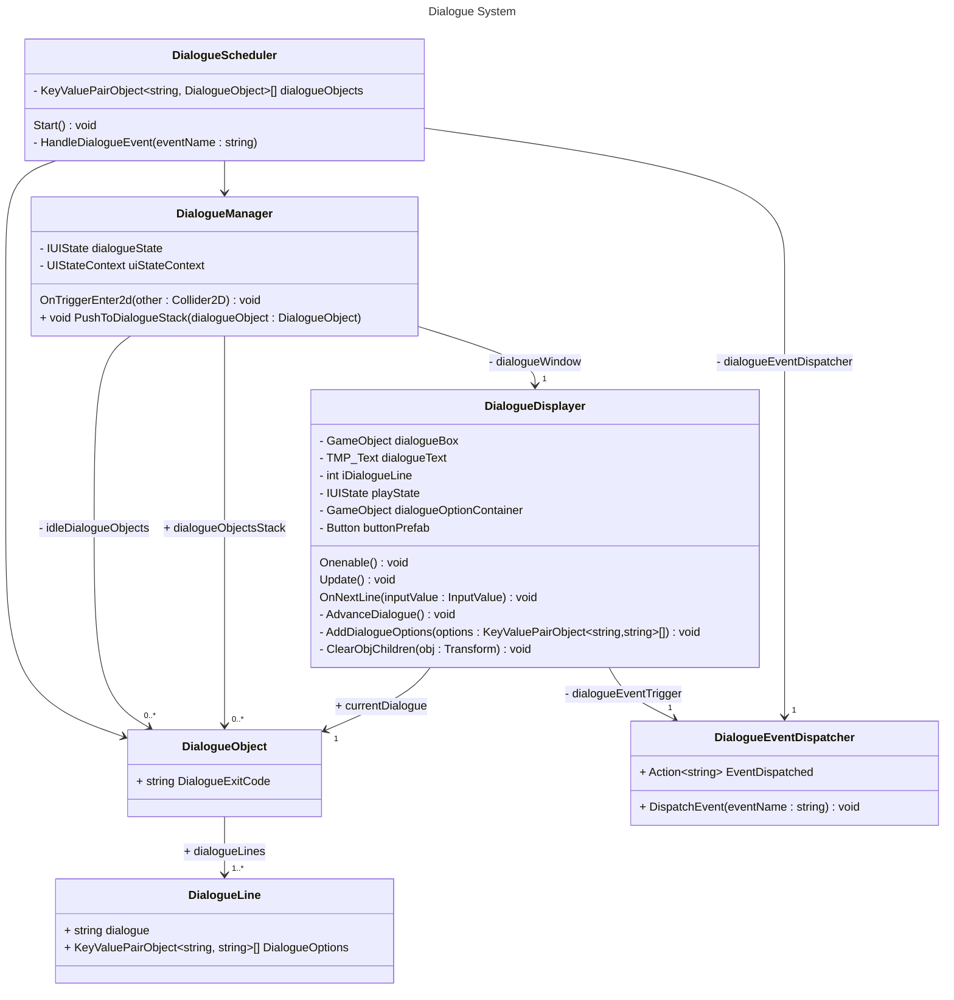

# Reflection on Game Development

For this game project I developed almost everything, excluding all the music and a few sprites that were drawn by a family member. As such the project contains a lot of scripts that have a large amount of different design considerations. The scripts also contains a more then a few considerations that were done because of some constraints of the Unity editor, some of these consideration sadly works directly against writing "good" or "clean" code. In this document i'll mention and reflect on part of one system, and what could be changed.

## Link to the github repository

My github, with all my code and block posts can be found at:

[https://github.com/bobbobogaming/ThePartysButler](https://github.com/bobbobogaming/ThePartysButler)

## The Dialogue System

The dialogue system contains many aspects that interacts with each other in different ways. The dialogue systems also sort of directly interacts with one system, the UI state handler.



The dialogue event dispatcher is the class that is responsible for broadcasting what an a dialogue option is picked or an dialogue is finished. If a dialogue option is picked it'll use the key of the dialogue option, as seen in the `DialogueLine` object, as the event name. When a dialogue finishes the `DialogueExitCode` of a `DialogueObject`, is used as the eventName. It can be seen that the `DialogueScheduler` has a reference to the event dispatcher, the scheduler will listen for any event name that matches a key in it's collection of dialogue objects and then, if a event matches that dialogue object will be pushed to the `DialogueManager` stack of dialogues. Sadly this "stack" is not using a real stack, because I needed the variable to still be serializable.

In the diagram there are a reference to an `IUIState`, which is a state definition, used to set the UI state handler. The state handler has the responsibility of handling what happens when switching between different states, but perhaps unlike other state machines, this one doesn't care about how each state functions.

## Managing Dialogue Instances

As mentioned the `DialogueManager` has a stack of dialogue object, the class however also has a normal list of dialogue objects, this might at first seem redundant, but each collection have different purposes for how they are used.

```csharp
public class DialogueManager : MonoBehaviour
{
  [SerializeField] private DialogueObject[] idleDialogueObjects;
  public DialogueObject[] dialogueObjectsStack;

// --- Hidden more hidden code

  void OnTriggerEnter2D(Collider2D other)
  {
    if (!other.CompareTag("Selector"))
    {
      return;
    }

    var lastInCollection = dialogueObjectsStack.LastOrDefault();
    if (lastInCollection != null) {
      dialogueWindow.currentDialogue = lastInCollection;
      dialogueObjectsStack = dialogueObjectsStack.SkipLast(1).ToArray();
    }
    else
    {
      dialogueWindow.currentDialogue = idleDialogueObjects[Mathf.Max(0,Mathf.RoundToInt(Random.value * (idleDialogueObjects.Length - 1)))];
    }
    uiStateContext.ChangeState(dialogueState);
    other.enabled = false;
  }

// --- Hidden more hidden code

}
```

What is immediately interesting here about this codes snippet, is about mocking stack functionality. By calling `dialogueObjectsStack.LastOrDefault()` I am essentially peeking at the top of the stack, then if there was any object on the stack that dialogue object is set as the current dialogue, and is removed from the stack. If no dialogue is on the stack a random one of the "idle dialogue" object is instead made the current dialogue. Lastly the UI state is changed. A thing that this method shouldn't be reasonable for but end up doing anyway, is the last line `other.enabled = false`. This sadly is done here as the state change disables the event source that is supposed to fire an event that would disable the `other` collider. This entire method looks at what dialogue objects an NPC has and then opens dialogue window, with the appropriate dialogue. The class nicely allows to set up a list of dialogue that a NPC always have and then have another dialogue collection that is filled up as when is appropriate with other systems like the quest system.

## Overall reflections about the project

I think I still have a lot to learn about how to best handle Unitys oddities and utilize its features. I'm not really happy with how often I would ignore ways of keeping the code more clean and using the right collection types, in order to have the code work best with the Unity editor. A good example of one thing that bothered me, was how the editor could not handle interfaces, because it can't guarantee that an implementation would be serializable, and as such I rarely used any interfaces, which would make it harder to replace some pieces of the code. 

I am mostly happy with the product I created, but I think I originally had a vision for the game that were leagues away from what could be achieved in the time frame of the project. During part of development I felt that by picking a genre of game that hinges more on the diversity if features than the depth of features, that I was forced to use more time creating more features to give a feel of completeness of the game.